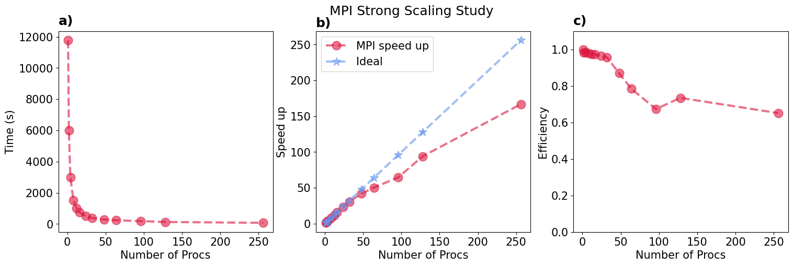
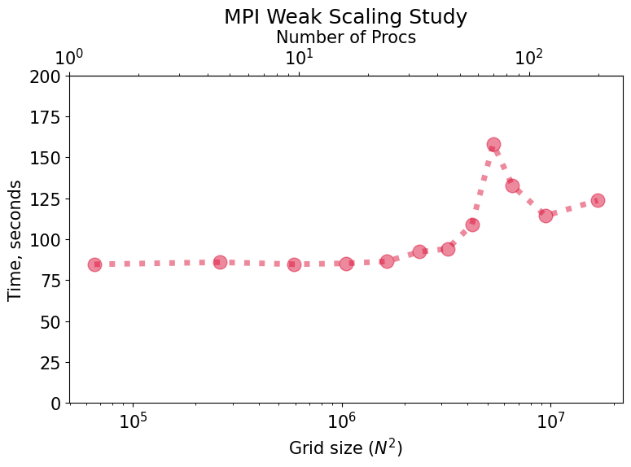
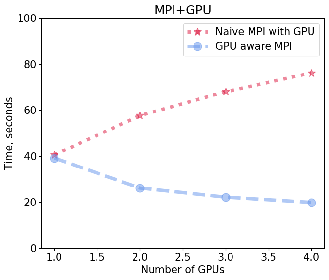

# 🧲 2D Ising Model: Serial, OpenMP, MPI, and GPU Implementations

## Introduction

This project models the equilibrium behavior of the two-dimensional Ising system using **Monte Carlo simulation techniques**. The primary focus is on **thermalization** and its effect on **magnetization** of a material where the lattice evolves toward equilibrium at a given temperature.

We consider a square lattice with:
- Periodic boundary conditions  
- Variable lattice sizes  
- The standard Ising Hamiltonian  

<figure>
  
  <figcaption>Ising model at various time-steps, t = 0, t = 5000, and t = 25000.</figcaption>
</figure>

---

## Implementations

This repository contains **six C++ implementations** of the 2D Ising model:

✅ Serial  
✅ Shared Memory (OpenMP)  
✅ GPU (CUDA)  
✅ Distributed Memory (MPI)  
✅ Distributed Memory + GPU (MPI + CUDA)  
✅ GPU-aware MPI  

---

# 1. Serial Implementation

The serial version serves as the **baseline** for all parallel implementations.

## Method

We use the **Metropolis Monte Carlo algorithm**:
- Compute energy difference ΔE for a spin flip  
- If ΔE < 0 → accept flip  
- Else → accept with probability:  
  e^(−ΔE / T)

---

## Execution Flow

1. Read input parameters (N, T, steps, output frequency, seed)
2. Initialize lattice with random spins (±1)
3. Run Monte Carlo loop:
   - Compute neighbor interactions
   - Apply Metropolis criterion
4. Periodically:
   - Compute energy and magnetization
   - Write outputs (dump + log)

---

## Checkerboard Update

To avoid dependency conflicts:

- Split lattice into **black and white sites**
- Update in two phases:
  1. Even (white) sites  
  2. Odd (black) sites  

**Benefits:**
- Deterministic update order  
- Enables safe parallelization  

---

# 2. Shared Memory (OpenMP)

Parallelization introduces **race conditions** due to neighbor dependencies.

## ✅ Solution
Use the **checkerboard scheme**:
- Ensures no two adjacent spins are updated simultaneously

## Key Features

- `#pragma omp parallel` for main simulation
- Work-sharing with `omp for`
- Reductions for:
  - Energy
  - Magnetization
- Single-threaded I/O to avoid conflicts

---

# 3. GPU Implementation (CUDA)

This version accelerates computation using the GPU.

## Key Ideas

- Each thread handles one lattice site  
- Uses **shared memory** for neighbor access  
- Two kernel launches per step (checkerboard phases)

## Execution Flow

1. Copy lattice to GPU
2. Generate random numbers on host
3. Launch CUDA kernels:
   - Load tiles into shared memory
   - Compute ΔE and apply Metropolis rule
4. Copy results back to CPU
5. Compute observables on host

---

# 4. Distributed Memory (MPI)

The lattice is decomposed **row-wise across MPI ranks**.

## Communication Pattern

- Each rank exchanges boundary rows with neighbors
- Ring topology:
  - `up` neighbor  
  - `down` neighbor  

## Key APIs used

- `MPI_Bcast` → distribute parameters  
- `MPI_Scatter` → distribute lattice  
- `MPI_Sendrecv` → exchange ghost rows  
- `MPI_Reduce` → compute global energy/magnetization  
- `MPI_Gather` → reconstruct full lattice for output  

---

# 5. MPI + GPU (Hybrid)

Combines **MPI domain decomposition** with **CUDA acceleration**.

##  Key Features

- Each MPI rank uses a GPU  
- Local lattice stored on GPU  
- Ghost rows exchanged between ranks  

## Execution Highlights

1. MPI distributes lattice  
2. Each rank:
   - Copies data to GPU  
   - Runs CUDA kernels (checkerboard updates)  
3. After each phase:
   - Exchange boundary rows (MPI)  
4. Compute global observables using `MPI_Reduce`  after a specified output frequency

---

# ✅ Verification

To ensure correctness, all implementations are validated against the serial version.

Run:

```bash
python verify.py
```


# Visualization of the output

In order to visualize the output from these simulations, we used Ovito software. Its free version can be downloaded from <https://www.ovito.org/>.
Steps to visualize the dump file (dump.out).
1. Once the ovito software is downloaded and launched, using File->Load, and navigate to the folder and select the file to be visualized (dump.out).
2. Load the file and click on "Add modification" 
3. Select "color coding" from the drop down menu
4. The -1/ +1 spins are shown in different color.
5. Use the panel on the bottom to display the configurations at different time steps.

# Organization of the input file

The text file ("in.input") is used to provide the parameters to run the simulation. These parameters are.
1. N : specifies the size of the simulation.
2. T : specifies the temperature of the simulation
3. NSTEP: specifies the total number of steps to run the simulation.
4. OUTPUT_FILE : specifies the name of the dump file output.
5. OUTPUT_FREQUENCY : specifies the frequency of the dump output, log output and the print on the console.
6. SEED : specifies the seed number for random number generator.

# Performance Benchmarking

- The Benchmarking is done on the modified code in the Benchmarking directory.
- Only difference is the generation of random number is perfomed in parallel.

## Strong scaling for MPI implementation

<figure>
  
  <figcaption>Strong scaling for MPI implementation</figcaption>
</figure>

## Weak scaling for MPI implementation

<figure>
  
  <figcaption>Weak scaling for MPI implementation</figcaption>
</figure>

## Impact of number of GPUs on computation time

<figure>
  
  <figcaption>Number of GPUs on computation time</figcaption>
</figure>
